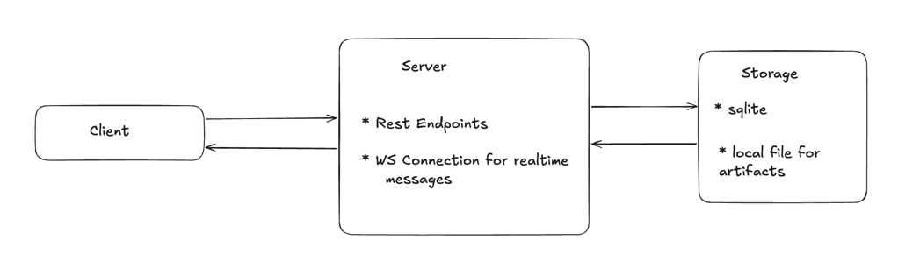

## System Architecture

### Functional Requirements
- Users should be able to send messages to each other
- Users should be able to create, send messages in group
- Users should be able to see who is typing
- Users should be able to send other media types like audio, video, pdfs
- In groups, only admin should be able to add, remove, update roles of participants; writers can send message, readers can only read

### Architecture

### Data Model
Details in app/models

1. users
2. conversations
3. conversation_members
4. messages

### Design Decisions

1. We are using REST to support most of the endpoints like createUser, createConversation etc but for message transport
    we are using WebSockets. Reason being, we dont need persistent bidirectional communication in other cases except 
    when a user sends a message and recipients should receive it in realtime. 
2. Storage layer is kept simple for the assignment purpose, we are using local storage db- sqlite and artifacts would be
   stored in artifacts directory
3. User registration is kept simple as well. No authentication, authorization is implemented
4. We are allowing only 1 active websocket connection for a user id, so case for a user connecting from multiple device
   is not allowed.

### Questions

**Q.** What are you using for implementing WebSockets?

**A.** We are using FastAPI. It is built on top of websockets library and Starlette. In code, we are using a ConnectionManager
that tracks the active connections of users, handles connecting and disconnecting, send message to a user or broadcast.

We have defined two types of ws events-
1. send_message
2. typing_start

Why FastAPI was chosen- Gives both REST and WebSocket support, request validation via pydantic and async support. Also 
previous experience in FastAPI helped.

**Q.** How would you support other message types like audio, documents, etc?

**A.** We are using a 2 phased approach here. Client uploads the file to server via Rest, once the upload is successful 
server returns file upload metadata information. Client would receive it and send a send_message event with metadata info.
When recipients wants to download file, they can download it from the file URL.
Websocket should not be used for uploads because file upload would be slow and block the connection. Plus, all the recipients
would not be interested in downloading the uploaded file. By this design they can download at their wish.

In a production setup, we can use a GCS bucket's signed URL feature. Client calls server, server returns a signed URL to
client. The client can upload directly to the temporary url.

**Q.** How do we check if someone is typing?

**A.** Currently, we are using typing_start websocket event to check that. Majority of it's logic should be on client side,
from backend's perspective we are just broadcasting this event to all users. The client should handle, not sending typing_start
event for every key stroke. Also in case of inactivity it should stop sending typing_start. We are not sending typing_stop
event but that can also be used. 

**Q.** How can we separate the Admin, Read, or Write members in the group?

**A.** We have defined user roles to handle this. It is implemented through conversation_members table that stores the role
of a user, in a conversation. Some decisions made on assumptions - 
1. Last admin cannot be demoted or removed
2. In direct conversation type, members cant be removed or added
3. Conversation creator is admin by default but can create more admins.
4. New member's default role is write